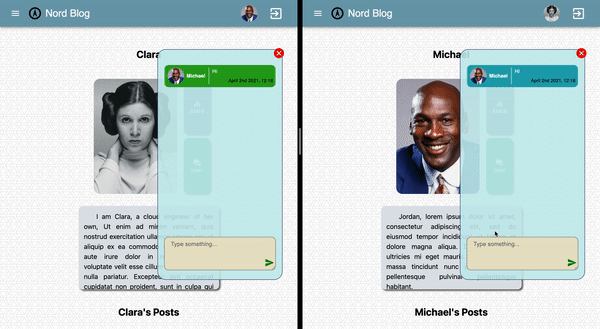
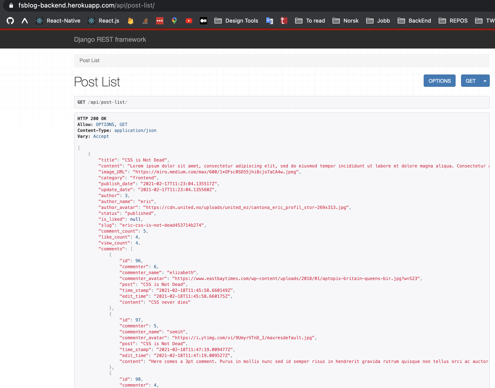

 
    
    <h1 align="center">Index of React.js Projects</h1>

 
  
| Name     | Links                                                      |           Overview                  |
|:--------:|:--------------------------------------------------------------:|------------------------------------:|
|FullStack Blog FrontEnd Side | -[Repository](https://github.com/SemihDurmus/FullStack_Blog_App_FrontEnd) -[Live on Heroku](https://fs-blog-frontend.herokuapp.com/)|
. 

  

  

  

  

|
|FullStack Blog BackEnd Side   (Created w Django)  | -[Repository](https://github.com/SemihDurmus/Fullstack_Blog_App_Backend.git)  -[Live on Heroku](https://fs-blog-backend.herokuapp.com/api/post-list/)  -[Base url and other endpoints](https://fs-blog-backend.herokuapp.com/)| |
|Movies | -[Repository](https://github.com/SemihDurmus/SDR_01_Movies) -[Live on GitHub](https://semihdurmus.github.io/SDR_01_Movies/)| |
